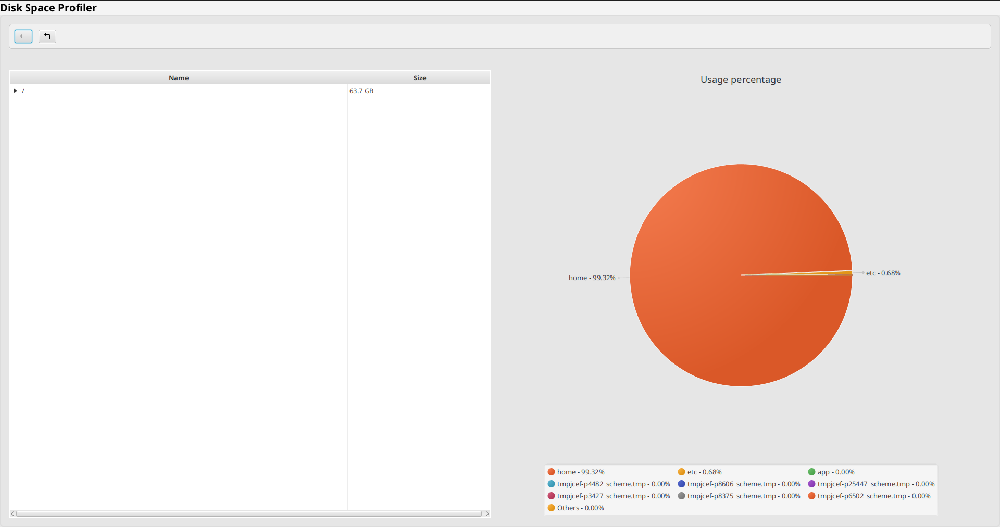
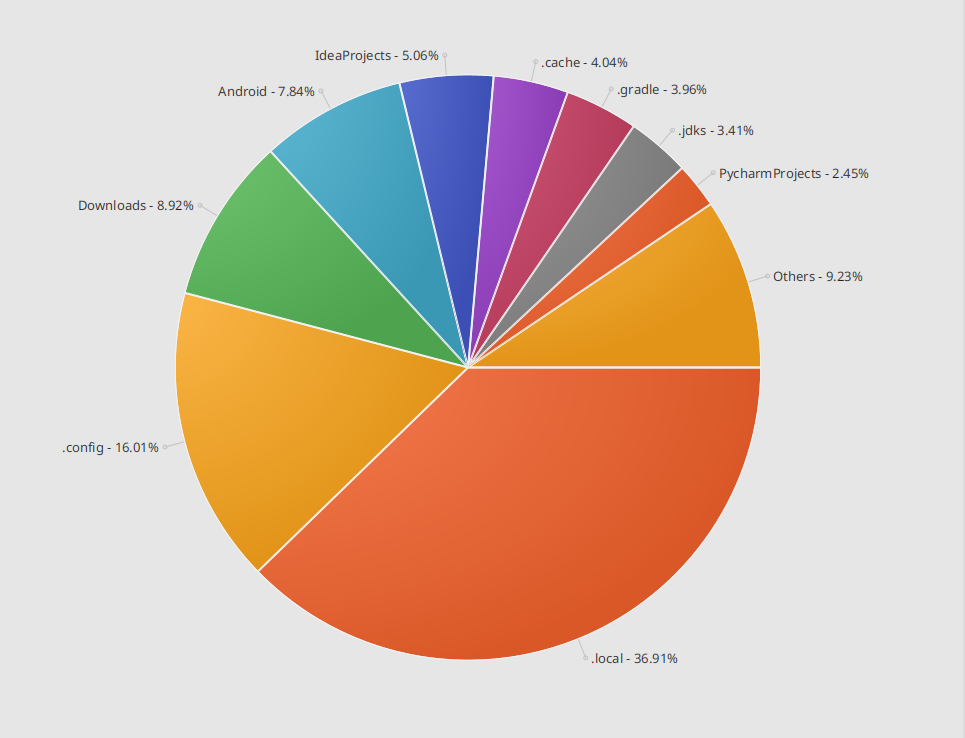
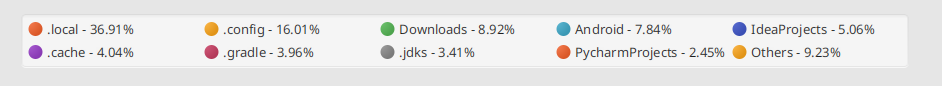

# disk-space-profiler

# Installation

```
mvn install
```

# Launch

```
mvn javafx:run
```

# UI/UX


Graphical user interface represents a file tree with columns:

* name - name of file or folder
* size - number of bytes/kb/mb/etc the resource occupies
  and a pie chart that shows top of heaviest resources in root folder

## File tree

You can control the file tree by:

* double-clicking any row - it will set the selected row to be a root
* by button in the tree header
    *  will return previous tree's root (if any)
    *  will open the parent folder of current root (if any)

## Pie chart

At the bottom of pie chart, you can find a legend that will present the heaviest files/folder and how much space they
occupy in percent.


