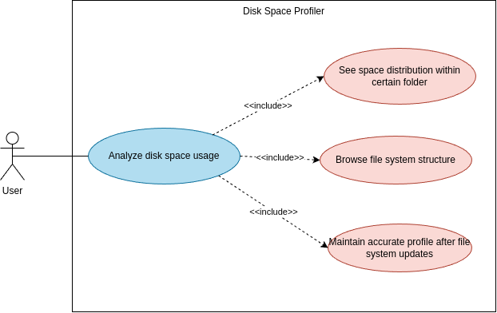
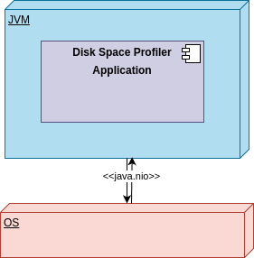

# Introduction and Goals

The app should provide disk space profiler service. Some general requirements:
- the intended usage of the utility is to find large unnecessary folders/files (to later delete or move them, freeing up space on the disk).
- the program must be able to respond to external changes in the directory (deletion, addition of folders/files)
- the utility is expected to have no limitations in terms of functionality on various popular operating systems: Windows, MacOS, and Linux.
- the app should provide correct data, be performant, have simple/clear and easy to maintain code 

## Requirements Overview

List of Functional Requirements (FRs):
- FR1: the app provides convenient UI and UX.
- FR2: the UI should remain responsive during the initial size calculation and while handling subsequent external changes.
- FR3: the utility is expected to have no limitations in terms of functionality on various popular operating systems: Windows, MacOS, and Linux.
- FR4: the app should provide correct data
- FR5: the app should be performant
- FR6: the app should have simple/clear and easy to maintain code

**Priority**

| Functional Requirement | Use-Case                                                                                                                                                                                              | Product Priority | Engineering Priority |
|------------------------|-------------------------------------------------------------------------------------------------------------------------------------------------------------------------------------------------------|------------------|----------------------|
| FR1                    | As a User,   I want the GUI to convenient to use  So that I can quickly locate and manage large files                                                                                         | Must-Have        | Must-Have            |
| FR2                    | As a User,   I want the GUI to remain responsive during initial profiling and when external changes occur So that I can continue to work with utility smoothly without freezes                | Mush-Have        | Must-Have            |
| FR3                    | As a User,   I want the app to work on different OS  So that I can rely on it independently on which OS I use                                                                                 | Mush-Have        | Must-Have            |
| FR4                    | As a User,   I want the app to provide accurate and reliable data about file and folder sizes So that I can confidently make decisions about deleting, moving, or organizing files            | Mush-Have        | Must-Have            |
| FR5                    | As a User,   I want the app to be performant So that I can quickly analyze and manage large files and folders without long wait times or delays.                                              | Mush-Have        | Must-Have            |
| FR6                    | As a Developer,   I want the app's code to be simple, clear, and easy to maintain So that future updates, bug fixes, and enhancements can be made efficiently and without introducing errors. | Could-Have       | Should-Have          |

## Quality Goals
Top Quality Attributes:
1) Functional Suitability 
   1) Functional correctness
2) Usability 
   1) Operability
3) Performance Efficiency 
   1) Time behaviour
4) Portability
   1) Adaptability
5) Maintainability
   1) Modifiability

**Motivation**
- Functional correctness - users demand precise space occupation data for confident usage (FR4).
- Operability - the app should have convent GUI that ease control of the utility (FR1, FR2).
- Time behaviour - the app should be performant enough to prevent freezes (FR5).
- Adaptability - the app should work correctly (i.e. adapt) for all popular OS: Linux, Windows, MacOS (FR3).
- Modifiability - the app should be easy to modify and maintain (FR6)

**Priority**

| Quality Attribute      | Priority    |
|------------------------|-------------|
| Functional correctness | Must-Have   |
| Operability            | Must-Have   |
| Time behaviour         | Must-Have   |
| Adaptability           | Must-Have   |
| Modifiability          | Should-Have |

## Stakeholders

List of stakeholders
- End users
- Contributors/Developers

**Expectations**

| Role                    | Expectations                                                          |
|-------------------------|-----------------------------------------------------------------------|
| End Users               | the app covers intended usage and aligns with described quality       |
| Contributors/Developers | the app has maintainable code for possible improvements/contributions |

# Architecture Constraints

- should run on the major operating systems (Windows, Linux, and Mac-OS)

# Context and Scope
## Business Context 

**UML Use-Case Diagram**

## Technical Context

**UML deployment diagram**

# Solution Strategy

| Quality Attribute      | Solution                                                                          | Motivation                                                                                                                         |
|------------------------|-----------------------------------------------------------------------------------|------------------------------------------------------------------------------------------------------------------------------------|
| Functional correctness | Ensure 80% branch coverage                                                        | Good test coverage minimizes the chance of errors                                                                                  |
| Operability            | Compose Multiplatform will be used                                                | Compose Multiplatform provides tools to create convenient UI/UX                                                                    |
| Time behaviour         | Space profiling will be asynchronous                                              | Asynchronous computing will make the application constantly responsive and prevent freezes while providing results upon completion |
| Time behaviour         | Utility will be a desktop application                                             | Desktop application will not have a web/network related overhead                                                                   |
| Adaptability           | Compose Multiplatform will be used                                                | Compose Multiplatform supports all major OS: Linux, Windows, MacOs                                                                 |
| Modifiability          | Use SonarQube for static analysis, "Maintainability rating" should be B or higher | High SonarQube's maintainability score implies small Technical debt ratio and consequently ease of maintenance                     |

# Building Block View

## Whitebox Overall System

# Runtime View

# Deployment View

## Infrastructure Level 1

## Infrastructure Level 2

# Cross-cutting Concepts

# Architecture Decisions

# Quality Requirements

## Quality Scenarios

# Risks and Technical Debts

# Glossary
